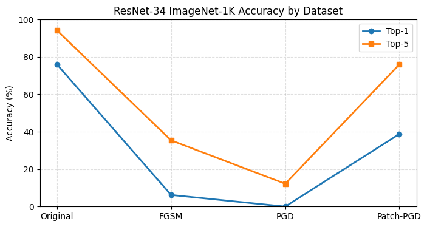

# Jailbreaking Deep Models: Adversarial Attacks  


**Authors**: Aniket Mane, Subhan Akhtar, Pranav Motarwar  
**Affiliation**: New York University  
**GitHub**: [Repository Link](https://github.com/PranavMotarwar/Jailbreaking-Deep-Models)  

---

## 📂 Repository Contents
| File/Folder       | Description                                  |
|--------------------|----------------------------------------------|
| `DL_project_3.ipynb` | Jupyter Notebook with full implementation    |
| `task5_transferability.png` | Graph for Task 5 results                  |
| `Deep_Learning_Mini_Project_3.pdf` | Project report (PDF)             |

---

## ▶️ Quick Start
1. **Run in Colab**:  
   [](https://colab.research.google.com/github/yourusername/jailbreaking-deep-models/blob/main/DL_project_3.ipynb)

2. **Local Execution**:
   ```bash
   # Install dependencies
   pip install -r requirements.txt
   
   # Launch Jupyter notebook
   jupyter notebook DL_project_3.ipynb

📊 ResNet-34 Accuracy Across Attack Types

The graph below shows the Top-1 and Top-5 classification accuracy of the ResNet-34 model on clean and adversarially perturbed datasets using FGSM, PGD, and Patch-PGD attacks.



	•	Clean data yields strong performance (Top-1: 76%, Top-5: 94%).
	•	FGSM reduces Top-1 to 6%, showing high vulnerability to fast gradient attacks.
	•	PGD (iterative FGSM) nearly breaks the model (Top-1: 0%, Top-5: 2%).
	•	Patch-PGD partially preserves model performance (Top-1: 39%, Top-5: 76%).

These results demonstrate the fragility of ResNet-34 under adversarial pressure, especially from iterative perturbations like PGD.

📊 Task 5: Transferability Graph

Transferability Results
*DenseNet-121 performance across adversarial datasets.
PGD attacks show strong cross-model transferability.*


**Key Observations**:
- **Original**: 74.80% Top-1 accuracy (baseline)  
- **FGSM**: Accuracy drops to 63.40% (-11.4% absolute)  
- **PGD**: Accuracy plummets to 53.60% (-21.2% absolute)  
- **Patch PGD**: Partial recovery to 71.00% (localized perturbations are less transferable)  

*Visualization shows adversarial examples crafted for ResNet-34 significantly degrade DenseNet-121 performance, demonstrating cross-model vulnerability.*

📄 Report Highlights

Key findings from Deep_Learning_Mini_Project_3.pdf:

Reduced ResNet-34 accuracy to 0.00% using PGD (ε=0.02)

Patch attacks (32x32, ε=0.3) achieved 41.20% Top-1 accuracy

FGSM perturbations transferred to DenseNet-121 with 63.40% Top-1 accuracy


🔍 How to Reproduce Results

Download TestDataSet.zip and unzip.

Run cells attached ipynb sequentially.

Results auto-generated in notebook and saved as PNG/PDF.


---

## 🤝 Acknowledgements

This project was completed as part of the **Deep Learning course at NYU Tandon School of Engineering** in **Spring 2025**.

We would like to thank our professor and teaching assistants for their support and guidance throughout the project.

---
